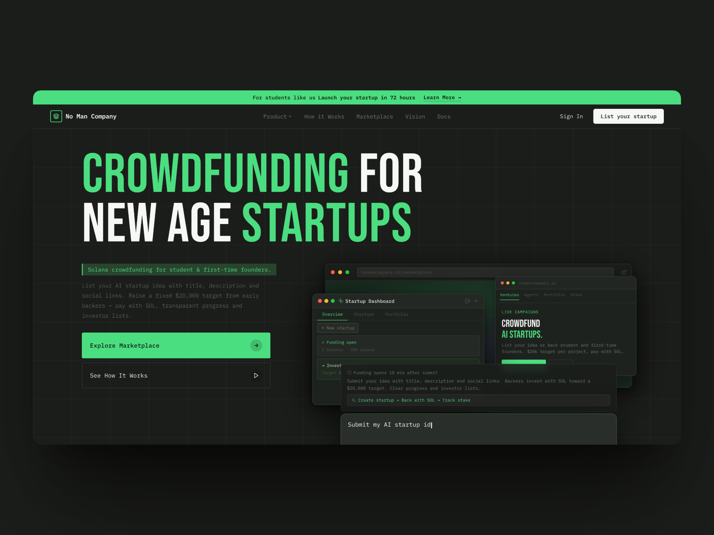

# No Man Company (ZMC) — Crowdfunding for New Age Startups



**Crowdfunding for new age startups.** A Solana-based platform where college students and first-time founders list ideas and raise a fixed **$20,000** target from early backers. Pay with SOL. Transparent progress. No smart contracts — simple, verifiable flows.

---

## The Problem

Many founders have ideas that die before they ever become products — not because the ideas are bad, but because the founders lack the resources to execute them.

Access to capital and visibility is uneven. Student and first-time founders often lack networks, track records, or the time to run long fundraising processes. Great ideas stay in notebooks instead of reaching users and backers who would support them.

---

## The Solution

**ZMC** is a crowdfunding platform built for this gap:

- **Founders** submit startup ideas (title, description, categories, founder social links). Funding opens **10 minutes** after submission so backers can invest quickly.
- **Backers** discover projects, see live funding progress and investor lists, and invest with **Solana (SOL)** toward a uniform **$20,000** target per project. Stake is calculated and stored on-chain verification.
- **Transparency** — every campaign shows how much has been raised and who has invested, so the community can trust the process.

The product is **crowdfunding-first**: listing, discovery, SOL payments, and portfolio tracking. We also use **automated Reddit posts** to promote listed startups and give them visibility in relevant communities, so ideas get in front of backers and builders who care.

---

## Features

### Crowdfunding

| Feature | Description |
|--------|-------------|
| **Public listing** | Founders add title, description, up to 4 categories (e.g. AI, SaaS, FinTech, Web3), and optional LinkedIn / X / GitHub links. |
| **Fixed target** | Every startup has a **$20,000** funding goal. Progress is shown as a percentage. |
| **Solana payments** | Backers connect a wallet (Phantom, Solflare, Coinbase, etc.), send SOL to the platform escrow. Backend verifies the transaction and records stake (1 SOL = $100; stake = investment USD / 20,000). The sol comes to our platform then we verify and send to Founder |
| **Funding window** | Funding opens **10 minutes** after a startup is submitted, then backers can invest until the target is reached. |
| **Discoverable listings** | Browse all startups with live funding progress and a transparent list of investors. |
| **Portfolio** | Logged-in users see their created startups and investments in one place. |

### Authentication & UX

- **Sign up / Log in** with email, password, and Solana wallet address.
- **Protected flows** for creating startups, investing, and viewing portfolio.
- **Clear states** — loading skeletons, validation errors, and wallet-connect prompts so users always know what’s happening.

### Reddit & distribution

- **Automated Reddit posts** are used to share and promote listed startups in relevant subreddits, so campaigns get in front of communities that care about new products and early-stage ideas. This is part of how we give founders “resources to execute” beyond capital alone.

---

## Tech Stack

| Layer | Stack |
|-------|--------|
| **Frontend** | React, Vite, TypeScript, Tailwind CSS, React Router, Axios |
| **Wallet / chain** | Solana (devnet/mainnet), `@solana/web3.js`, `@solana/wallet-adapter-react` (Phantom, Solflare, Coinbase, Trust, Ledger, Torus) |
| **Backend** | Bun, Express, TypeScript |
| **Database** | PostgreSQL with Prisma (Prisma 7, `@prisma/adapter-pg`) |
| **Auth** | JWT (payload includes `userId`); password hashing with Bun |

No Rust or Anchor: investments use **simple SOL transfers** to a single **escrow wallet**. The backend verifies each transaction (receiver = escrow, correct amount, sender) and then records the investment and stake.

---

## Project Structure

```
NMC/
├── backend/                 # Bun + Express API
│   ├── config/              # DB (Prisma + pg), env (JWT, escrow, RPC, valuation)
│   ├── middleware/           # JWT auth
│   ├── routes/              # auth, startups, invest, portfolio
│   ├── services/            # Solana transaction verification
│   ├── prisma/              # schema, migrations
│   └── index.ts
├── forntend/                # React + Vite app (note: folder name typo)
│   ├── src/
│   │   ├── components/      # Layout, ProtectedRoute
│   │   ├── context/         # AuthContext
│   │   ├── lib/             # API client (axios)
│   │   └── pages/           # Landing, Login, Signup, Startups, StartupDetail, Build, Portfolio
│   └── public/
├── testsprite_tests/        # TestSprite / PRD-related assets
└── README.md
```

---

## Getting Started

### Prerequisites

- **Bun** (backend): [bun.sh](https://bun.sh)
- **pnpm** (frontend): [pnpm.io](https://pnpm.io)
- **PostgreSQL** (local or hosted)
- **Solana wallet** (e.g. Phantom) and devnet SOL for testing

### 1. Database

Create a PostgreSQL database and set its URL in the backend `.env`.

### 2. Backend

```bash
cd backend
cp .env.example .env
# Edit .env: DATABASE_URL, JWT_SECRET, ESCROW_WALLET, SOLANA_RPC_URL, PORT
bun install
bunx prisma migrate dev    # run migrations
bun run generate           # prisma generate
bun run dev                # watch mode
```

Default port: **3001**. Health: `GET /health`, `GET /health/db`.

### 3. Frontend

```bash
cd forntend
cp .env.example .env
# Edit .env: VITE_API_URL, VITE_ESCROW_WALLET, VITE_SOLANA_RPC
pnpm install
pnpm dev
```

Default port: **5173**. Root `/` shows the **landing page**; the app (startups, build, portfolio) lives under **/app** (e.g. `/app/startups`, `/app/build`, `/app/portfolio`). Logged-in users are sent to the dashboard from “Explore Marketplace” and “List your startup”; others are sent to signup.

### 4. Environment summary

**Backend (`.env`):**

- `DATABASE_URL` — PostgreSQL connection string  
- `JWT_SECRET` — secret for signing JWTs  
- `ESCROW_WALLET` — Solana public key where all investments are sent  
- `SOLANA_RPC_URL` — e.g. Helius devnet/mainnet  
- `PORT` — server port (default 3001)  

**Frontend (`.env`):**

- `VITE_API_URL` — backend base URL (e.g. `http://localhost:3001`)  
- `VITE_ESCROW_WALLET` — same as backend (for display/checks)  
- `VITE_SOLANA_RPC` — RPC endpoint for wallet/transactions  

---

## Main Flows

1. **Sign up** → name, email, password, Solana wallet address → JWT + redirect to app.
2. **List a startup** → Build page: name, description, categories (1–4), optional LinkedIn/X/GitHub → `fundingOpenAt = now + 10 minutes`, `valuation = 20000`.
3. **Discover** → Startups list with progress and countdown; click through to detail + investor list.
4. **Invest** → Connect wallet → Enter SOL amount → Send SOL to escrow → Backend verifies tx (with retries for RPC delay) → Stake recorded; UI updates.
5. **Portfolio** → View your startups and investments.

Stake formula: `investmentUSD = amountSol * 100`, `stake = investmentUSD / 20000`.

---

## Deployment

- **Frontend**: e.g. Vercel — build from `forntend`, set `VITE_*` env vars, root `/`.
- **Backend**: e.g. Railway — build/run from `backend`, set `DATABASE_URL`, `JWT_SECRET`, `ESCROW_WALLET`, `SOLANA_RPC_URL`, `PORT`. Run migrations before first start.
- **CORS**: Allow your frontend origin in the backend.

---

## License & Contributing

This project is part of **No Man Company (ZMC)**. Use and adapt it for learning or as a base for your own crowdfunding product. If you open issues or PRs, focus on crowdfunding behavior, Reddit/distribution ideas, or docs so we can keep the README and flows clear for everyone.

---

**Crowdfunding for new age startups.** List your idea. Back a founder. Raise $20k with Solana.
